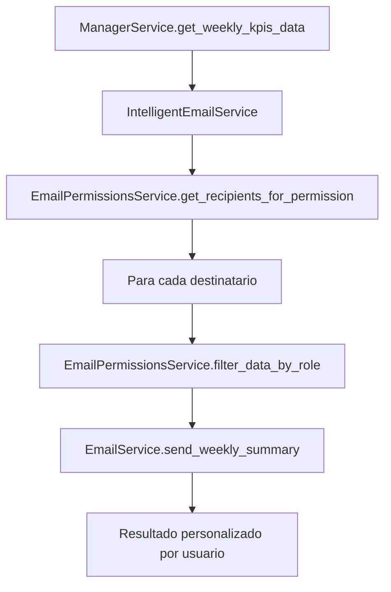

# Sistema de Email Inteligente - Pagora EDP

## 📋 Resumen Ejecutivo

El **Sistema de Email Inteligente** es una arquitectura avanzada que implementa **filtrado basado en roles** para enviar información personalizada y relevante a cada destinatario según su responsabilidad y nivel de acceso.

## 🎯 Objetivos

- **Personalización**: Cada usuario recibe solo la información relevante para su rol
- **Seguridad**: Control de acceso basado en permisos y responsabilidades
- **Eficiencia**: Reducción de ruido informativo y mejora de la experiencia del usuario
- **Escalabilidad**: Sistema modular que permite agregar nuevos roles y tipos de email

## 🏗️ Arquitectura del Sistema

### Componentes Principales

```
┌─────────────────────────────────────────────────────────────┐
│                    Sistema de Email Inteligente             │
├─────────────────────────────────────────────────────────────┤
│  ┌─────────────────┐    ┌─────────────────┐                │
│  │ EmailPermissions│    │ IntelligentEmail│                │
│  │ Service         │    │ Service         │                │
│  └─────────────────┘    └─────────────────┘                │
│           │                       │                        │
│           └───────────────────────┼────────────────────────┘
│                                   │                        │
│  ┌─────────────────┐    ┌─────────────────┐                │
│  │ EmailService    │    │ Database Models │                │
│  │ (Base)          │    │ (EmailUser,     │                │
│  └─────────────────┘    │  EmailUserProject│                │
│                          │  EmailUserClient)│                │
│                          └─────────────────┘                │
└─────────────────────────────────────────────────────────────┘
```

## 👥 Roles y Permisos

### Definición de Roles

| Rol                 | Descripción               | Acceso                            |
| ------------------- | ------------------------- | --------------------------------- |
| **Executive**       | Ejecutivos de alto nivel  | Toda la información               |
| **Manager**         | Gerentes de área          | Información general               |
| **Project Manager** | Jefes de proyecto         | Solo sus proyectos asignados      |
| **Controller**      | Controllers operacionales | Toda la información operacional   |
| **Finance**         | Departamento financiero   | Información financiera            |
| **Client**          | Clientes externos         | Solo información de sus proyectos |

### Matriz de Permisos

| Permiso             | Executive | Manager | Project Manager | Controller | Finance | Client |
| ------------------- | --------- | ------- | --------------- | ---------- | ------- | ------ |
| `all_data`          | ✅        | ✅      | ❌              | ✅         | ❌      | ❌     |
| `project_data`      | ✅        | ✅      | ✅              | ✅         | ❌      | ❌     |
| `financial_data`    | ✅        | ✅      | ❌              | ❌         | ✅      | ❌     |
| `operational_data`  | ✅        | ✅      | ❌              | ✅         | ❌      | ❌     |
| `client_data`       | ✅        | ✅      | ❌              | ❌         | ❌      | ✅     |
| `critical_alerts`   | ✅        | ✅      | ✅              | ✅         | ✅      | ❌     |
| `weekly_summary`    | ✅        | ✅      | ✅              | ✅         | ✅      | ❌     |
| `payment_reminders` | ❌        | ❌      | ❌              | ✅         | ✅      | ✅     |

## 🔧 Implementación Técnica

### 1. Servicio de Permisos (`EmailPermissionsService`)

```python
class EmailPermissionsService:
    """Service for managing email permissions and data filtering."""

    def get_user_role(self, email: str) -> EmailRole:
        """Get user role from database or fallback logic."""

    def filter_data_by_role(self, data: Dict, user_email: str, data_type: str) -> Dict:
        """Filter data based on user role and data type."""

    def get_recipients_for_permission(self, permission: EmailPermission) -> List[str]:
        """Get all recipients that have a specific permission."""
```

### 2. Servicio de Email Inteligente (`IntelligentEmailService`)

```python
class IntelligentEmailService:
    """Intelligent email service with role-based data filtering."""

    def send_weekly_summary_intelligent(self, kpis_data: Dict) -> Dict:
        """Send weekly summary with intelligent filtering."""

    def send_critical_alerts_intelligent(self, critical_edps: List) -> Dict:
        """Send critical alerts with intelligent filtering."""

    def send_payment_reminders_intelligent(self, reminder_data: List) -> Dict:
        """Send payment reminders with intelligent filtering."""
```

### 3. Modelos de Base de Datos

#### `EmailUser`

```python
class EmailUser(db.Model):
    id = Column(Integer, primary_key=True)
    email = Column(String(255), unique=True, nullable=False)
    name = Column(String(255), nullable=False)
    role = Column(String(50), nullable=False)  # executive, manager, etc.
    is_active = Column(Boolean, default=True)
```

#### `EmailUserProject`

```python
class EmailUserProject(db.Model):
    user_id = Column(Integer, ForeignKey('email_users.id'))
    project_name = Column(String(255), nullable=False)
    project_manager = Column(String(255), nullable=False)
    is_active = Column(Boolean, default=True)
```

#### `EmailUserClient`

```python
class EmailUserClient(db.Model):
    user_id = Column(Integer, ForeignKey('email_users.id'))
    client_name = Column(String(255), nullable=False)
    is_active = Column(Boolean, default=True)
```

## 📊 Flujo de Datos

### 1. Resumen Semanal Inteligente



### 2. Filtrado de Datos por Rol

#### Ejecutivo (Acceso Completo)

```json
{
  "kpis_principales": { "total_edps": 15, "monto_total": 500000000 },
  "proyectos_por_jefe": [
    { "proyecto": "OT2467", "cliente": "Arauco", "total_monto": 187164099 },
    { "proyecto": "OT4948", "cliente": "Enel", "total_monto": 56969497 }
  ]
}
```

#### Jefe de Proyecto (Solo sus proyectos)

```json
{
  "kpis_principales": { "total_edps": 2, "monto_total": 187164099 },
  "proyectos_por_jefe": [
    { "proyecto": "OT2467", "cliente": "Arauco", "total_monto": 187164099 }
  ]
}
```

#### Cliente (Solo sus proyectos)

```json
{
  "kpis_principales": { "total_edps": 2, "monto_total": 187164099 },
  "proyectos_por_jefe": [
    { "proyecto": "OT2467", "cliente": "Arauco", "total_monto": 187164099 }
  ]
}
```

## 🚀 Uso del Sistema

### 1. Configuración Inicial

```bash
# Crear tablas de usuarios de email
cd edp_mvp
python migrate_email_users.py

# Probar el sistema
python test_intelligent_email_system.py
```

### 2. Uso en el Código

```python
from app.services.intelligent_email_service import IntelligentEmailService
from app.services.manager_service import ManagerService

# Inicializar servicios
intelligent_email = IntelligentEmailService()
manager_service = ManagerService()

# Obtener datos
kpis_data = manager_service.get_weekly_kpis_data().data

# Enviar resumen semanal inteligente
results = intelligent_email.send_weekly_summary_intelligent(kpis_data)

print(f"Enviados: {results['successful_sends']}")
print(f"Fallidos: {results['failed_sends']}")
```

### 3. Gestión de Usuarios

```python
from app.models.email_user import EmailUser, EmailUserProject

# Crear nuevo usuario
user = EmailUser(
    email="nuevo.jefe@empresa.com",
    name="Nuevo Jefe",
    role="project_manager"
)

# Asignar proyectos
project = EmailUserProject(
    user_id=user.id,
    project_name="OT9999",
    project_manager="Nuevo Jefe"
)
```

## 📈 Beneficios

### Para Ejecutivos

- **Visión completa**: Acceso a todos los KPIs y proyectos
- **Información consolidada**: Resúmenes ejecutivos sin ruido
- **Toma de decisiones**: Datos relevantes para decisiones estratégicas

### Para Jefes de Proyecto

- **Enfoque**: Solo información de sus proyectos asignados
- **Acción directa**: Alertas específicas sobre sus responsabilidades
- **Eficiencia**: Menos tiempo procesando información irrelevante

### Para Controllers

- **Control operacional**: Acceso completo a datos operacionales
- **Gestión de alertas**: Todas las alertas críticas del sistema
- **Seguimiento**: Recordatorios de pago y seguimiento financiero

### Para Clientes

- **Transparencia**: Información específica de sus proyectos
- **Comunicación directa**: Recordatorios de pago personalizados
- **Confianza**: Acceso controlado a información relevante

## 🔒 Seguridad y Privacidad

### Control de Acceso

- **Autenticación**: Verificación de usuarios activos
- **Autorización**: Permisos basados en roles
- **Auditoría**: Logs de envío y acceso

### Protección de Datos

- **Filtrado**: Solo datos autorizados por rol
- **Encriptación**: Emails enviados de forma segura
- **Retención**: Políticas de retención de datos

## 🛠️ Mantenimiento y Escalabilidad

### Agregar Nuevos Roles

1. Definir el rol en `EmailRole` enum
2. Agregar permisos en `role_permissions` dict
3. Implementar lógica de filtrado específica
4. Actualizar documentación

### Agregar Nuevos Tipos de Email

1. Definir el tipo en `EmailPermission` enum
2. Implementar método de filtrado
3. Agregar método de envío en `IntelligentEmailService`
4. Actualizar templates si es necesario

### Monitoreo y Logs

```python
# Logs automáticos incluyen:
- Usuarios que reciben cada tipo de email
- Filtrado aplicado por rol
- Éxito/fallo de envíos
- Tiempo de procesamiento
```

## 📝 Próximos Pasos

### Fase 1 (Actual)

- ✅ Sistema básico de roles y permisos
- ✅ Filtrado de datos por rol
- ✅ Envío inteligente de emails
- ✅ Base de datos de usuarios

### Fase 2 (Próxima)

- [ ] Interfaz web para gestión de usuarios
- [ ] Preferencias personalizadas por usuario
- [ ] Programación automática de emails
- [ ] Métricas y analytics de envío

### Fase 3 (Futura)

- [ ] Machine Learning para optimización
- [ ] Integración con sistemas externos
- [ ] Notificaciones push/móviles
- [ ] API REST para gestión externa

## 🤝 Contribución

Para contribuir al sistema:

1. **Fork** el repositorio
2. **Crear** una rama para tu feature
3. **Implementar** los cambios
4. **Probar** con el script de pruebas
5. **Documentar** los cambios
6. **Pull Request** con descripción detallada

## 📞 Soporte

Para dudas o problemas:

- **Issues**: Crear issue en GitHub
- **Documentación**: Revisar esta documentación
- **Logs**: Verificar logs de la aplicación
- **Pruebas**: Ejecutar scripts de prueba

---

**Sistema de Email Inteligente - Pagora EDP**  
_Desarrollado para optimizar la comunicación y gestión de información empresarial_
