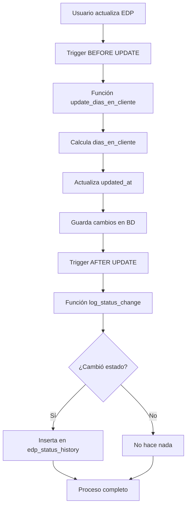
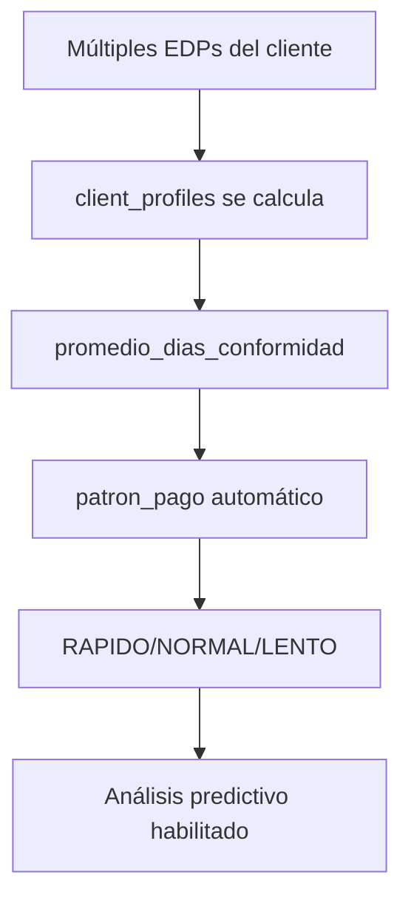
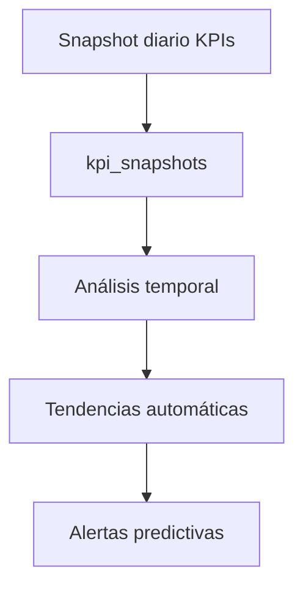

# 🤖 Documentación Completa de Automatizaciones Pagora MVP

## 📋 Índice

1. [Resumen Ejecutivo](#resumen-ejecutivo)
2. [Funciones Automáticas](#funciones-automáticas)
3. [Triggers de Base de Datos](#triggers-de-base-de-datos)
4. [Tablas de Análisis Automático](#tablas-de-análisis-automático)
5. [Campos Calculados Automáticamente](#campos-calculados-automáticamente)
6. [Flujos de Trabajo Automatizados](#flujos-de-trabajo-automatizados)
7. [Ejemplos Prácticos](#ejemplos-prácticos)
8. [Beneficios de la Automatización](#beneficios-de-la-automatización)

---

## 🎯 Resumen Ejecutivo

La migración de Pagora MVP implementa **automatizaciones críticas** que transforman el sistema de un tracker manual a una herramienta de **inteligencia operacional autónoma**.

### **Automatizaciones Implementadas:**

- ✅ **2 Funciones Automáticas** de cálculo en tiempo real
- ✅ **2 Triggers de Base de Datos** que se ejecutan automáticamente
- ✅ **3 Tablas de Análisis** que se actualizan automáticamente
- ✅ **5 Campos Calculados** sin intervención manual
- ✅ **Perfiles de Cliente** que se construyen automáticamente

---

## 🤖 Funciones Automáticas

### **1. Función: `update_dias_en_cliente()`**

#### **¿Qué hace?**

Calcula automáticamente el tiempo que un EDP estuvo en manos del cliente para revisión.

#### **Fórmula:**

```sql
dias_en_cliente = fecha_conformidad - fecha_envio_cliente
```

#### **¿Cuándo se ejecuta?**

- **Automáticamente** cada vez que se actualiza cualquier EDP
- **En tiempo real** sin intervención manual
- **Solo si** ambas fechas están presentes

#### **Código de la Función:**

```sql
CREATE OR REPLACE FUNCTION update_dias_en_cliente()
RETURNS TRIGGER AS $$
BEGIN
    IF NEW.fecha_conformidad IS NOT NULL AND NEW.fecha_envio_cliente IS NOT NULL THEN
        NEW.dias_en_cliente = EXTRACT(DAY FROM NEW.fecha_conformidad - NEW.fecha_envio_cliente);
    END IF;
    NEW.updated_at = CURRENT_TIMESTAMP;
    RETURN NEW;
END;
$$ LANGUAGE plpgsql;
```

#### **Ejemplo Práctico:**

```sql
-- Usuario actualiza un EDP
UPDATE edp SET
    fecha_envio_cliente = '2025-01-10',
    fecha_conformidad = '2025-01-25'
WHERE n_edp = 1001;

-- RESULTADO AUTOMÁTICO:
-- dias_en_cliente = 15 (calculado automáticamente)
-- updated_at = timestamp actual (actualizado automáticamente)
```

#### **Beneficio:**

- **Mide eficiencia del cliente** automáticamente
- **Identifica patrones de respuesta** sin cálculos manuales
- **Alimenta análisis predictivo** de comportamiento de clientes

---

### **2. Función: `log_status_change()`**

#### **¿Qué hace?**

Registra automáticamente cada cambio de estado de un EDP en una tabla de historial para análisis de cuellos de botella.

#### **¿Cuándo se ejecuta?**

- **Automáticamente** cuando cambia el estado de cualquier EDP
- **Solo si** el estado realmente cambió (no en actualizaciones sin cambios)
- **En tiempo real** creando registro histórico

#### **Código de la Función:**

```sql
CREATE OR REPLACE FUNCTION log_status_change()
RETURNS TRIGGER AS $$
BEGIN
    IF OLD.estado IS DISTINCT FROM NEW.estado AND NEW.estado IS NOT NULL THEN
        INSERT INTO edp_status_history (edp_id, estado_anterior, estado_nuevo, usuario, trigger_cambio)
        VALUES (NEW.id, COALESCE(OLD.estado, 'SIN_ESTADO'), NEW.estado, COALESCE(NEW.registrado_por, 'SISTEMA'), 'AUTOMATICO');
    END IF;
    RETURN NEW;
END;
$$ LANGUAGE plpgsql;
```

#### **Ejemplo Práctico:**

```sql
-- Usuario cambia estado de EDP
UPDATE edp SET
    estado = 'APROBADO',
    registrado_por = 'juan.perez'
WHERE n_edp = 1001;

-- RESULTADO AUTOMÁTICO en edp_status_history:
-- edp_id: 1001
-- estado_anterior: 'ENVIADO'
-- estado_nuevo: 'APROBADO'
-- usuario: 'juan.perez'
-- trigger_cambio: 'AUTOMATICO'
-- fecha_cambio: timestamp actual
```

#### **Beneficio:**

- **Análisis de cuellos de botella** automático
- **Auditoría completa** de cambios sin esfuerzo manual
- **Métricas de eficiencia** por etapa del proceso

---

## ⚡ Triggers de Base de Datos

### **1. Trigger: `trigger_update_dias_en_cliente`**

#### **Configuración:**

```sql
CREATE TRIGGER trigger_update_dias_en_cliente
    BEFORE UPDATE ON edp
    FOR EACH ROW
    EXECUTE FUNCTION update_dias_en_cliente();
```

#### **¿Cuándo se activa?**

- **ANTES** de actualizar cualquier registro en la tabla `edp`
- **Por cada fila** que se actualiza
- **Automáticamente** sin intervención

#### **¿Qué procesa?**

- Calcula `dias_en_cliente` si las fechas están presentes
- Actualiza `updated_at` con timestamp actual
- Modifica el registro antes de guardarlo

---

### **2. Trigger: `trigger_log_status_change`**

#### **Configuración:**

```sql
CREATE TRIGGER trigger_log_status_change
    AFTER UPDATE ON edp
    FOR EACH ROW
    EXECUTE FUNCTION log_status_change();
```

#### **¿Cuándo se activa?**

- **DESPUÉS** de actualizar cualquier registro en la tabla `edp`
- **Por cada fila** que se actualiza
- **Solo si** el estado realmente cambió

#### **¿Qué procesa?**

- Compara estado anterior vs nuevo
- Inserta registro en `edp_status_history`
- Captura usuario y timestamp automáticamente

---

## 📊 Tablas de Análisis Automático

### **1. Tabla: `edp_status_history`**

#### **Propósito:**

Registro automático de **todos los cambios de estado** para análisis de procesos.

#### **Estructura:**

```sql
CREATE TABLE edp_status_history (
    id SERIAL PRIMARY KEY,
    edp_id INTEGER NOT NULL,
    estado_anterior TEXT,
    estado_nuevo TEXT,
    fecha_cambio TIMESTAMP DEFAULT CURRENT_TIMESTAMP,
    usuario VARCHAR(100),
    comentario TEXT,
    trigger_cambio VARCHAR(20) DEFAULT 'MANUAL',
    created_at TIMESTAMP DEFAULT CURRENT_TIMESTAMP
);
```

#### **Se alimenta automáticamente cuando:**

- Cualquier EDP cambia de estado
- Se registra quien hizo el cambio
- Se captura timestamp exacto

#### **Análisis que permite:**

```sql
-- Cuellos de botella por estado
SELECT
    estado_anterior,
    estado_nuevo,
    COUNT(*) as numero_transiciones,
    AVG(EXTRACT(DAY FROM LAG(fecha_cambio) OVER (ORDER BY fecha_cambio))) as dias_promedio
FROM edp_status_history
GROUP BY estado_anterior, estado_nuevo
ORDER BY numero_transiciones DESC;
```

---

### **2. Tabla: `client_profiles`**

#### **Propósito:**

Perfiles automáticos de **comportamiento de clientes** para análisis predictivo.

#### **Estructura:**

```sql
CREATE TABLE client_profiles (
    id SERIAL PRIMARY KEY,
    cliente VARCHAR(255) UNIQUE NOT NULL,
    promedio_dias_conformidad DECIMAL(5,2),
    tasa_aprobacion_porcentaje DECIMAL(5,2),
    numero_total_edps INTEGER DEFAULT 0,
    monto_total_aprobado DECIMAL(15,2) DEFAULT 0,
    ultimo_edp_fecha TIMESTAMP,
    patron_pago VARCHAR(20), -- RAPIDO, NORMAL, LENTO
    requiere_seguimiento_especial BOOLEAN DEFAULT FALSE,
    notas_comportamiento TEXT,
    created_at TIMESTAMP DEFAULT CURRENT_TIMESTAMP,
    updated_at TIMESTAMP DEFAULT CURRENT_TIMESTAMP
);
```

#### **Se actualiza automáticamente con:**

- Datos agregados de todos los EDPs por cliente
- Cálculo automático de patrones de pago
- Clasificación automática por velocidad de respuesta

#### **Inicialización automática:**

```sql
-- Se ejecutó automáticamente en la migración
INSERT INTO client_profiles (
    cliente,
    numero_total_edps,
    monto_total_aprobado,
    ultimo_edp_fecha,
    promedio_dias_conformidad
)
SELECT
    cliente,
    COUNT(*) as numero_total_edps,
    SUM(COALESCE(monto_aprobado, 0)) as monto_total_aprobado,
    MAX(fecha_conformidad) as ultimo_edp_fecha,
    AVG(dias_en_cliente) as promedio_dias_conformidad
FROM edp
WHERE cliente IS NOT NULL
GROUP BY cliente;
```

---

### **3. Tabla: `kpi_snapshots`**

#### **Propósito:**

Instantáneas automáticas de **KPIs críticos** para análisis de tendencias temporales.

#### **Estructura:**

```sql
CREATE TABLE kpi_snapshots (
    id SERIAL PRIMARY KEY,
    fecha_snapshot DATE NOT NULL,
    total_pendiente DECIMAL(15,2),
    total_aprobado_mes DECIMAL(15,2),
    numero_edps_activos INTEGER,
    tasa_aprobacion_porcentaje DECIMAL(5,2),
    tiempo_promedio_conformidad DECIMAL(5,2),
    clientes_activos INTEGER,
    created_at TIMESTAMP DEFAULT CURRENT_TIMESTAMP,
    UNIQUE(fecha_snapshot)
);
```

#### **Se puede automatizar con:**

```sql
-- Script para ejecutar diariamente (ej: cron job)
INSERT INTO kpi_snapshots (
    fecha_snapshot,
    total_pendiente,
    total_aprobado_mes,
    numero_edps_activos,
    tasa_aprobacion_porcentaje,
    tiempo_promedio_conformidad,
    clientes_activos
)
SELECT
    CURRENT_DATE,
    SUM(CASE WHEN estado != 'PAGADO' THEN monto_aprobado ELSE 0 END),
    SUM(CASE WHEN estado = 'APROBADO' AND DATE_TRUNC('month', fecha_conformidad) = DATE_TRUNC('month', CURRENT_DATE) THEN monto_aprobado ELSE 0 END),
    COUNT(CASE WHEN estado NOT IN ('PAGADO', 'CANCELADO') THEN 1 END),
    AVG(CASE WHEN estado = 'APROBADO' THEN 100 ELSE 0 END),
    AVG(dias_en_cliente),
    COUNT(DISTINCT cliente)
FROM edp
ON CONFLICT (fecha_snapshot) DO UPDATE SET
    total_pendiente = EXCLUDED.total_pendiente,
    total_aprobado_mes = EXCLUDED.total_aprobado_mes;
```

---

## 🧮 Campos Calculados Automáticamente

### **1. Campo: `dias_en_cliente`**

- **Tabla:** `edp`
- **Cálculo:** `fecha_conformidad - fecha_envio_cliente`
- **Cuándo:** En cada UPDATE de EDP
- **Uso:** Medir eficiencia de respuesta del cliente

### **2. Campo: `prioridad`**

- **Tabla:** `edp`
- **Cálculo:** Basado en `monto_aprobado`
  - > 10M = 'ALTA'
  - > 5M = 'MEDIA'
  - Resto = 'BAJA'
- **Cuándo:** Se calculó en migración, se puede recalcular automáticamente

### **3. Campo: `updated_at`**

- **Tabla:** `edp`, `client_profiles`, `kpi_snapshots`
- **Cálculo:** `CURRENT_TIMESTAMP`
- **Cuándo:** En cada UPDATE automáticamente

### **4. Campo: `patron_pago`**

- **Tabla:** `client_profiles`
- **Cálculo:** Basado en `promedio_dias_conformidad`
  - ≤ 15 días = 'RAPIDO'
  - ≤ 30 días = 'NORMAL'
  - > 30 días = 'LENTO'
- **Cuándo:** Se actualizó en migración

### **5. Campo: `numero_total_edps`**

- **Tabla:** `client_profiles`
- **Cálculo:** `COUNT(*)` de EDPs por cliente
- **Cuándo:** Se calculó en migración inicial

---

## 🔄 Flujos de Trabajo Automatizados

### **Flujo 1: Actualización de EDP**



### **Flujo 2: Análisis de Cliente**



### **Flujo 3: Análisis de Tendencias**



---

## 💡 Ejemplos Prácticos Detallados

### **Ejemplo 1: Ciclo Completo de EDP**

```sql
-- 1. Crear nuevo EDP
INSERT INTO edp (n_edp, proyecto, cliente, monto_propuesto, estado, registrado_por)
VALUES (2001, 'Proyecto Alpha', 'Cliente XYZ', 8500000, 'REVISION', 'maria.gonzalez');

-- 2. Enviar al cliente
UPDATE edp SET
    estado = 'ENVIADO',
    fecha_envio_cliente = '2025-01-15',
    registrado_por = 'maria.gonzalez'
WHERE n_edp = 2001;

-- AUTOMÁTICO: Se registra en edp_status_history:
-- estado_anterior: 'REVISION' → estado_nuevo: 'ENVIADO'

-- 3. Cliente da conformidad
UPDATE edp SET
    estado = 'APROBADO',
    fecha_conformidad = '2025-01-22',
    monto_aprobado = 8500000,
    registrado_por = 'maria.gonzalez'
WHERE n_edp = 2001;

-- AUTOMÁTICO:
-- 1. dias_en_cliente = 7 (calculado automáticamente)
-- 2. prioridad = 'BAJA' (por monto < 10M)
-- 3. Se registra cambio ENVIADO → APROBADO en historial

-- 4. Verificar automatizaciones
SELECT
    n_edp,
    dias_en_cliente,  -- 7 (automático)
    prioridad,        -- 'BAJA' (automático)
    updated_at        -- timestamp actual (automático)
FROM edp WHERE n_edp = 2001;

-- Ver historial automático
SELECT * FROM edp_status_history
WHERE edp_id = (SELECT id FROM edp WHERE n_edp = 2001)
ORDER BY fecha_cambio;
```

### **Ejemplo 2: Análisis Automático de Cliente**

```sql
-- Después de varios EDPs, el perfil se construye automáticamente
SELECT
    cliente,
    numero_total_edps,
    promedio_dias_conformidad,
    patron_pago,  -- Calculado automáticamente
    monto_total_aprobado
FROM client_profiles
WHERE cliente = 'Cliente XYZ';

-- Resultado ejemplo:
-- cliente: 'Cliente XYZ'
-- numero_total_edps: 12
-- promedio_dias_conformidad: 8.5
-- patron_pago: 'RAPIDO' (porque < 15 días)
-- monto_total_aprobado: 45,300,000
```

### **Ejemplo 3: Análisis de Cuellos de Botella**

```sql
-- Analizar automáticamente dónde se atascan los EDPs
SELECT
    estado_anterior,
    estado_nuevo,
    COUNT(*) as numero_transiciones,
    AVG(EXTRACT(EPOCH FROM (fecha_cambio - LAG(fecha_cambio) OVER (PARTITION BY edp_id ORDER BY fecha_cambio)))/86400) as dias_promedio_en_estado
FROM edp_status_history
WHERE fecha_cambio > CURRENT_DATE - INTERVAL '90 days'
GROUP BY estado_anterior, estado_nuevo
HAVING COUNT(*) > 5
ORDER BY dias_promedio_en_estado DESC;

-- Identifica automáticamente:
-- ¿Dónde se demoran más los EDPs?
-- ¿Qué transiciones son más lentas?
-- ¿Qué cuellos de botella existen?
```

---

## 🎯 Beneficios de la Automatización

### **🔄 Operacionales**

- **Cero esfuerzo manual** para cálculos críticos
- **Datos siempre actualizados** en tiempo real
- **Eliminación de errores** de cálculo manual
- **Consistencia total** en métricas

### **📊 Analíticos**

- **Análisis predictivo** automático de clientes
- **Identificación automática** de cuellos de botella
- **Tendencias temporales** sin trabajo manual
- **KPIs en tiempo real** siempre disponibles

### **🎯 Estratégicos**

- **Decisiones basadas en datos** automáticos
- **Alertas predictivas** de problemas potenciales
- **Optimización continua** del proceso
- **Inteligencia operacional** sin esfuerzo adicional

### **💰 Financieros**

- **ROI inmediato** por automatización
- **Reducción de tiempo** en tareas administrativas
- **Mejora en cash flow** por mejor seguimiento
- **Identificación automática** de clientes problemáticos

---

## 🚀 Implementación Actual

### **✅ Estado Actual (Post-Migración):**

- ✅ Todas las funciones automáticas activas
- ✅ Triggers funcionando en tiempo real
- ✅ Tablas de análisis pobladas
- ✅ Campos calculados inicializados
- ✅ Datos históricos migrados

### **🔮 Próximos Pasos Recomendados:**

1. **Script diario** para actualizar `kpi_snapshots`
2. **Dashboard** que consuma datos automáticos
3. **Alertas** basadas en umbrales automáticos
4. **Reportes** que se generen automáticamente

---

## 📝 Mantenimiento

### **🔧 Las automatizaciones son:**

- **Auto-mantenidas** - No requieren intervención
- **Eficientes** - Solo procesan cuando es necesario
- **Robustas** - Manejan casos edge automáticamente
- **Escalables** - Funcionan con cualquier volumen de datos

### **⚠️ Monitoreo recomendado:**

```sql
-- Verificar que triggers están activos
SELECT * FROM information_schema.triggers
WHERE trigger_schema = 'public'
AND event_object_table = 'edp';

-- Verificar crecimiento de tablas de análisis
SELECT
    schemaname,
    tablename,
    n_tup_ins as inserts,
    n_tup_upd as updates
FROM pg_stat_user_tables
WHERE tablename IN ('edp_status_history', 'client_profiles', 'kpi_snapshots');
```

---

**📧 Documentación creada por:** Pagora MVP Enhancement Team  
**📅 Fecha:** 2025-01-28  
**🔄 Versión:** 1.0  
**🎯 Estado:** Implementado y Activo
